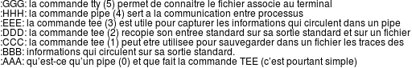

# Les Tubes et Filtres #

## Exercice 1:

1. `ps -ef` puis `ps -ef | grep bash`
2. `cat pipes` retourne

   

3.
   1. `cat pipes` pour afficher le contenu de pipes
   2. `cut -c1 pipes` pour afficher le premier caractère de chaque ligne du fichier pipes.
   3. `cut -c2- pipes` pour afficher sur chaque ligne tous les caractères sauf le premier caractère
   4. `cut -d' ' -f1,3- pipes`: afficher le contenu du fichier pipes en supprimant le second mot de chaque ligne (un mot est une suite de caractères ne
contenant pas d’espace)
   5. `grep commande pipes` : afficher uniquement les lignes du fichier pipes contenant le mot commande
   6. `grep "-" pipes` : afficher les lignes du fichier pipes contenant le caractère « - »,
   7. `grep -ve "-" pipes` : afficher les lignes du fichier pipes ne contenant pas le caractère « - »,
   8. `grep -i "tee" pipes` : afficher les lignes du fichier pipes contenant le mot tee quelque soit la hauteur des lettres (capitale ou minuscule) qui le
composent,

4. En combinant des filtres via des tubes écrivez maintenant les commandes permettant d’effectuer les actions suivantes : 
   1. `cut -c2 pipes  | sort` : afficher dans l’ordre lexicographique le second caractère de chaque ligne du fichier pipes ,
   2. `sed -n '5p' pipes| tr "[:lower:]" "[:upper:]"` ou `tail -3 pipes | head -1`: afficher uniquement la 5ème ligne du fichier pipes en remplaçant toutes les lettres par leur équivalent en minuscules,
   3. `grep -w pour pipes | wc -l` : afficher le nombre de ligne du fichier pipes contenant exactement le mot _pour_,
   4. `grep fichier pipes | tee /dev/pts/1 |  wc -l` : afficher le nombre de ligne du fichier pipes contenant le mot fichier dans le terminal courant et les lignes contenant le
mot fichier dans un second terminal que vous aurez ouvert pour l’occasion (la page tty(1) doit pouvoir vous être utile),
   5. `grep pipe pipes | sed -e 's/pipe/tube/g'` : afficher les lignes du fichier pipes contenant le mot pipe en ayant remplacé le mot pipe par le mot tube.
   6. `grep commande pipes | sort -k5 | tee /dev/pts/1 | wc -l` : afficher le nombre de ligne du fichier pipes contenant le mot commande dans le terminal courant et les lignes conte-
nant le mot commande dans un second terminal. Les lignes apparaissant sur le second terminal devront être triées sur le
cinquième mot de chaque ligne.

## Exercice 2:

1. La commande `getent passwd` permet d’afficher la liste des informations concernant les utilisateurs du système. Le format
de cette liste est documenté dans la page **passwd(5)** . Le système gère des utilisateurs étudiants du département informatique,
du département génie biologique, etc. En utilisant les tubes et des filtres écrivez les commandes permettant d’effectuer les
actions suivantes :
    1. ̀` :  afficher le nombre d’utilisateurs du système.
    2. ̀` : afficher le nombre de prénoms différents parmi tous les utilisateurs.
    3. ̀` : afficher le prénom le plus utilisé parmi les utilisateurs ainsi que le nombre d’utilisateurs portant ce prénom.
    4. ̀` : sachant que les étudiants du département informatique ont leur répertoire principal dans /home/infoetu , afficher le
nombre d’étudiants inscrits au département informatique
    5. ̀` : afficher le nombre d’étudiants inscrits au département informatique sur le terminal courant et la liste des prénoms et
noms de ces étudiants sur un second terminal. Chaque ligne affichée sur ce second terminal devra comprendre le prénom
d’un étudiant puis un caractère tabulation (`\t`) puis le nom de cet étudiant.
    6. ̀` : afficher la lettre la plus souvent utilisée comme première lettre (majuscule) d’un prénom avec sa fréquence d’utilisation,
    7. ̀` : sachant que tous les utilisateurs d’un même groupe ont leur répertoire principal dans un répertoire portant le nom de
ce groupe (par exemple tous les enseignants, membres du groupe infoens , ont leur répertoire dans /home/infoens ),
afficher le nombre de groupes unix principaux différents,
    8. ̀` : afficher le nombre d’utilisateurs homonymes (noms identiques pour 2 utilisateurs).

2. En utilisant les tubes et des filtres écrivez les commandes permettant d’effectuer les actions suivantes :
    - `` : afficher la liste des utilisateurs (uniquement leur login) s’étant connecté sur la machine. Cette liste devra être triée dans
l’ordre décroissant du nombre de connexion,
    - `` : afficher la liste des utilisateurs s’étant connecté juste avant un redémarrage (utilisateur reboot ) de la machine.