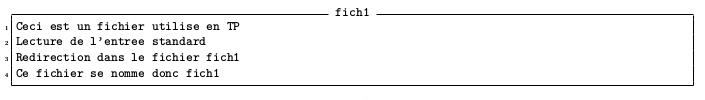
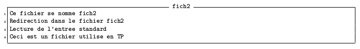

# Manipulations de processus

### Exercice 1: Manipulation de base

1. Démarrez la commande xeyes: `xeyes`
2. Essayez maintenant de démarrer une nouvelle fois la commande xeyes . Est-ce possible ? *Non*
3. Stoppez la commande démarrée en frappant simultanément les touches <kbd>Ctrl-Z</kbd>
4. Redémarrez la commande stoppée en arrière-plan: `bg`
5. Démarrez un nouveau processus en arrière plan exécutant la commande xeyes: `xeyes &`
6. Exécutez la ligne de commande suivante :
  `xeyes & xcalc & xlogo & xclock & xload & xterm & `

7. En utilisant la commande ps ainsi que les messages produits par la ligne de commande de la question précédente associez à chaque numéro de jobs démarré le nom du programme qu’il exécute:
   : `ps -j`

8. Vérifier votre réponse avec la commande jobs : `jobs`
9. Après avoir lu la page du manuel de la commande ps , déterminez graphiquement la hiérarchie des processus en cours. Quelle commande avez-vous utilisée ?
   ` ps f`

10. Arrêtez maintenant complètement les processus exécutant les commandes xlogo et xload en utilisant uniquement la commande kill que vous appliquez à des numéros de jobs (numéros généralement inférieur à 10) c’est-à-dire sans utiliser de PID : `jobs` pour avoir les numéros de jobs
    - xlogo : `kill -KILL %4`
    - xload : `kill -KILL %6`

11. Stoppez maintenant les processus exécutant les commandes xclock et xcalc en utilisant leur numéro de processus ( PID ). Pour stopper les processus vous devez envoyer le signal STOP aux processus concernés via la commande kill: `ps -j` pour voir les jobs avec les numéros de PID
    - xclock : `kill -STOP 13372`
    - xcalc  : `kill -STOP 13370`

12. Essayez de vous servir de la calculatrice. Que se passe-t-il ? : *Rien*

13. Utilisez la commande jobs pour faire le bilan des processus actuellement attachés à votre terminal (les jobs): `jobs`

14. Combien y a-t-il de processus stoppé ? en cours d’exécution ? Lesquels ? :

15. Faites redémarrer le processus exécutant xclock via l’envoi d’un signal ( CONT ) avec la commande kill à celui-ci: `kill -CONT %numero_jobs_xclock`

16. Le processus redémarre-t-il en arrière plan ou en avant-plan ?

17. Faites redémarrer le processus exécutant xcalc en avant plan via l’appel de la commande fg . Comment avez-vous du spécifier le processus : via son PID ou son numéro de job ? : `fg %numero_jobs`

18. Arrêtez le processus exécutant la commande xcalc sans utiliser la souris. Comment avez-vous fait ? <kbd>Ctrl-C</kbd>

19. Faites passer le processus exécutant la commande xclock en avant plan. Comment avez-vous fait ? : `fg %numero_jobs`

20. Stoppez-le, puis faites le redémarrer via la commande bg . Comment avez-vous du spécifier le processus : via son PID ou son numéro de job ? <kbd>Ctrl-Z</kbd> puis `bg`

21. Arrêtez tous les processus démarrés lors de cet exercice en une seule ligne de commande:
    `kill -KILL [liste_des_PID]`

### Exercice 2: Manipulation des processus et de leur état

1. Dans cet exercice vous allez utiliser une commande particulière nommée sleep . À l’aide du manuel informez-vous du comportement et de l’utilisation de cette commande. `man sleep`

2. Essayez et comparez les commandes suivantes :
   - ` sleep 3 ; echo A` : attend 3 secondes et affiche le caractère `A`
   - ` echo A ; sleep 3` : affiche le caractère `A` puis attend 3 seconde et revient au prompt
   - ` sleep 3 & echo A` : lance *sleep 3* et *echo A* en parallèle, *echo A* se termine avant avec la commande *sleep 3* est mis en arrière-plan pendant 3 secondes. 
   - ` echo A & sleep 3` : lance *sleep 3* et *echo A* en parallèle, *echo A* se termine en premier et la commande *sleep 3* continue pendant 3 seconde et se termine
   - ` (echo A ; sleep 3) &` : les commandes s'éxecutent en sequénce et en arrière plan, *echo A* est éxecuté pendant que *sleep 3* attend 3 secondes avant de se terminer
   - ` (sleep 3 ; echo A) &` : l'ensemble du bloc `()` est mis en attente en arrière plan pendant 3 secondes puis passe en avant plan et *echo A* est éxecutée.

3. Remplissez le tableau suivant, de façon à spécifier à quel moment le caractère A, le caractère B et le prompt du shell apparaîssent sur le terminal (par convention le caractère $ repésentera l’apparition du prompt) :

| Commandes                                 |  t=0s  |  t=3s  |  t=6s  |
|-------------------------------------------|------- |--------| ------ |
|`echo A ; sleep 3 ; echo B`                |`A`     |`B$`    |``      |
|`echo A ; sleep 3 & echo B`                |`AB`    |``      |``      |
|`( echo A ; sleep 3 ) & echo B`            |`BA`    |``      |``      |
|`echo A ; ( sleep 3 & echo B )`            |`AB`    |``      |``      |
|`echo A ; ( sleep 3 ; echo B ) &`          |`A`     |`$B`    |``      |
|`sleep 3 & echo A ; ( sleep 3 ; echo B )`  |`A`     |`B`     |``      |
|`sleep 3 & echo A & ( sleep 3 ; echo B )`  |`A`     |`B$`    |``      |
|`sleep 3 & echo A & ( sleep 3 & echo B ) &`|`AB`    |``      |``      |
|`sleep 3 & echo A & ( sleep 3 ; echo B ) &`|`A`     |`$B`    |``      |

4. Vérifiez vos réponses en exécutant les commandes de chacune des lignes.

### Exercice 3: Les redirections d'entrées/sorties

1. Sans utiliser la commande vi , ni un autre éditeur de texte, mais en utilisant la commande cat et l’opérateur > créez les fichiers fich1 et fich2 suivant :
   - `cat 1> fich1 << TOTO`
   
     
   - `cat > fich2`
   
     

2. Lisez la page du manuel de mate-terminal (ou celle de x-terminal-emulator ) de façon à trouver comment vous pouvez lors du lancement de la commande spécifier un titre au terminal que vous démarrez. Ce titre devra être présent dans la barre de titre de la fenêtre démarrée. Essayez par exemple de démarrer un terminal ayant pour titre le mot toto : `mate-terminal -t TITRE`

3. Démarrez 3 terminaux graphiques en utilisant la commande mate-terminal et les possibilités de démarrage en arrière-plan. Dans la suite de l’énoncé on désignera ces 3 terminaux par les alias A , B et C . Pour vous simplifier le travail donner comme titre à vos terminaux les alias spécifiés: `mate-terminal -t A &  mate-terminal -t B &  mate-terminal -t C &`

4. Pour cette question vous devez saisir vos commandes uniquement dans le terminal A :
   1. Identifiez pour chacun des terminaux le fichier associé: `tty` dans chacun des terminaux
   2. Afficher le contenu du fichier fich1 dans le terminal B: `cat fich2 > /dev/pts/3`
   3. Toujours en utilisant la commande cat , mais cette fois après avoir lu le manuel, créez le fichier fich3 constitué de la concaténation du contenu des fichiers fich1 et fich2 : `cat fich1 fich2 > fich3`
   4. Lancez la commande `cat fich1 fich150` :

      
      
   5. Lancez la commande précédente en redirigeant la sortie standard dans le terminal B et la sortie d’erreur dans C : `cat fich1 > /dev/pts/3 fich150 2> /dev/pts/1`
   6. Comment peut-on rediriger la sortie standard sur la sortie d’erreur ? : en utilisant `2>&1`
   7. En utilisant la réponse à la question précédente refaites la question 5 en redirigeant le tout vers le terminal B : `cat fich1 fich150 >/dev/pts/3 2>&1`